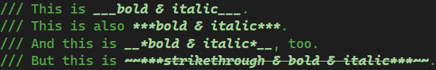
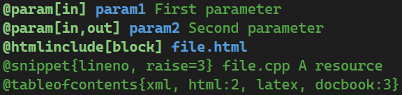
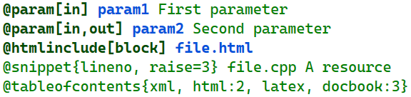
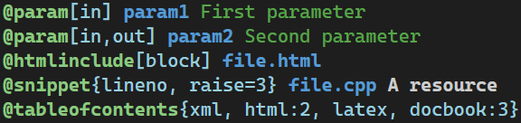
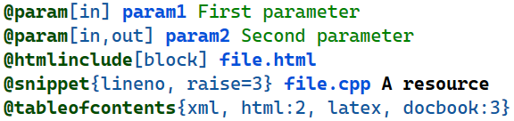
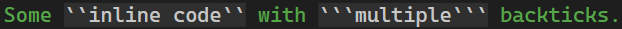

# v1.10.0 (????? ongoing)
**Major changes:** 
* Support new commands:
  * `\requirement`, `\satisfies` and `\verifies` (introduced in Doxygen [v1.16.0](https://www.doxygen.nl/manual/changelog.html#log_1_16)).
  * `\mermaid`, `\endmermaid` and `\mermaidfile` (introduced in Doxygen [v1.17.0](https://www.doxygen.nl/manual/changelog.html#log_1_17)).
* Updated existing commands:
  * Support the braced options of the `\cite` command that were introduced in Doxygen [v1.14.0](https://www.doxygen.nl/manual/changelog.html#log_1_14).
  * Improved `\param`: 
    * Unnamed parameters (`-`) that were introduced in Doxygen [v1.17.0](https://www.doxygen.nl/manual/changelog.html#log_1_17) are now supported.
    * Multiple parameters with spaces in-between (e.g. `\param x, y, z These are coordinates.`) are now properly supported.
* Updated quick info:
  * Documentation of all commands updated from Doxygen 1.13.1 to the latest v1.17.0.
  * The quick info popup now shows text parts with classifications with proper formatting (e.g. inline code now usually uses a monospace font).
* Implemented [#8](https://github.com/Sedeniono/VSDoxyHighlighter/issues/8): Improved [Doxygen-style emphasis markdown](https://www.doxygen.nl/manual/markdown.html#md_emphasis) support. 
  * Triple emphases (e.g. `***bold and italic***` or `**_bold and italic_**`) are now supported and are rendered as bold \& italic by default. Combination with strikethrough is also supported.  
    
  * The formatting can be configured using the new classifications `VSDoxyHighlighter - Emphasis (huge)` and `VSDoxyHighlighter - Strikethrough + emphasis (huge)` in the VS options in the "Fonts \& Colors" dialog.
  * Generally aligned the recognition of all emphases with the behavior of Doxygen v1.17.0.
* A "please rate" notice is shown after 30 days. The user can close it, and it will never appear again.
* Checked that the extension works without issue in VS2026 18.6.0. It also continues to work in VS2022 17.0.

# v1.9.0 (January 6, 2025)
**Major changes:** 
* Support new commands introduced in Doxygen [v1.13.0](https://www.doxygen.nl/manual/changelog.html#log_1_13_0) and [v1.13.1](https://www.doxygen.nl/manual/changelog.html#log_1_13_1): `\plantumlfile`, `\?` and `\!`.  
Note: Doxygen v1.13.0 now supports the `strip` and `nostrip` options for the `\dontinclude` and `\include` commands; VSDoxyHighlighter already supported them since [v1.8.0](https://github.com/Sedeniono/VSDoxyHighlighter/releases/tag/v1.8.0), so no changes there.
* Updated quick info documentation of all commands to Doxygen v1.13.1.

# v1.8.0 (December 14, 2024)
**Major changes:**
* The [special commands](https://www.doxygen.nl/manual/commands.html) of Doxygen [v1.11](https://www.doxygen.nl/manual/changelog.html#log_1_11) and [v1.12](https://www.doxygen.nl/manual/changelog.html#log_1_12) (the current version) are now fully supported:
    * New commands of Doxygen v1.11.0 (`\important`, `\subparagraph` and `\subsubparagraph`) and Doxygen v1.12.0 (`\showenumvalues`, `\hideenumvalues`) were added.
    * Newly introduced `{...}` options that were added to the following commands are supported now: `\snippet`, `\snippetdoc`, `\include`, `\includedoc`, `\dontinclude`
    * Updated quick info documentation of all commands to Doxygen v1.12.0.
* Significantly improved support for Doxygen command options in brackets (`[...]`) and braces (`{...}`):
    * Such options are now using their own highlighting classification:  
      *Old version:*  
        
      *New version:*  
        
      Details:
        * The following commands are affected: `\param`, `\snippet`, `\snippetdoc`, `\include`, `\includedoc`, `\dontinclude`, `\example`, `\htmlinclude`, `\htmlonly`, `\code`, `\image`, `\startuml`, `\fileinfo`, `\inheritancegraph`, `\tableofcontents`.
        * The classification is called "*VSDoxyHighlighter - Clamped parameter*" in the "Font and Colors" dialog in the Visual Studio options.
        * Previously, the VSDoxyHighlighter configuration listed these commands several times, once for each supported option (e.g. it listed `\param`, `\param[in]`, `\param[out]` and `\param[in,out]`). Since now the options have their own proper classification, each command appears only once (e.g. only `\param`) and the "duplicated" commands (e.g. `\param[in]`, `\param[out]` and `\param[in,out]`) have been removed from the configuration. If you had configured custom classifications for these commands, only the command and parameter classifications of the "base" command (e.g. `\param`) are kept, with the new "*VSDoxyHighlighter - Clamped parameter*" classification inserted for the options.
        * If you want to restore the old coloring where the command options had the same color as the command itself, simply change the color of "*VSDoxyHighlighter - Clamped parameter*" in the "Font and Colors" dialog in the Visual Studio options to match with the one of "*VSDoxyHighlighter - Command*".
    * The parsing of the `in` and `out` options of `\param[in,out]` is now closer to what Doxygen is doing: Whitespaces before and within the options are supported now, as well as omitting the comma (e.g. `\param[inout]` or `\param[out in]` are now valid).
    * The `file` option in `\fileinfo{file}` is not allowed by Doxygen and thus has been removed. On the other hand, `\fileinfo{name}` is now supported.
    * The options of `\tableofcontents` are now supported.
* Improved handling of markdown-style backticks (`` ` ``): Multiple successive backticks are now supported, but still only in a **single** line. (Highlighting over multiple lines is not yet supported.)  
     
* Fixed autocomplete of `\param` parameter suggestion for macros when there is a function after the macro definition. The extension incorrectly showed the parameters of the function instead of the macro as autocomplete suggestion.

# v1.7.1 (November 15, 2024)
**Fixed [#6](https://github.com/Sedeniono/VSDoxyHighlighter/issues/6):** The extension now works with [Visual Studio 2022 17.12.0](https://devblogs.microsoft.com/visualstudio/visual-studio-2022-v17-12-with-dotnet-9/), which has been released a few days ago (November 12, 2024). I also confirmed that the new version 1.7.1 of the extension still works with older versions of Visual Studio 2022 (specifically tested with VS 2022 17.7.5).

# v1.7.0 (June 6, 2024)
**Major change:** Allow installation on Arm64. This fixes #4. Thanks to [EmrecanKaracayir](https://github.com/EmrecanKaracayir) for testing.

# v1.6.0 (May 9, 2024)
* Added IntelliSense for the **arguments** of the Doxygen commands `\param`, `\tparam`, `\p` and `\a`: The extension lists the parameters and/or template parameters of the next function, class, struct, macro or alias template. Note that this fails in certain cases because of "quirks" in the Visual Studio API. See the "known problems" section in the readme.
* Updated quick info tooltips to Doxygen version 1.10.0

# v1.5.0 (October 1, 2023)
* Updated extension for Doxygen 1.9.7 and 1.9.8 (support of new and changed commands; updated help texts).
* Fixed support of `\htmlonly[block]` in autocomplete and quick info.

# v1.4.0 (May 8, 2023)
* Added highlighting for `\\` and `\"` commands.
* Added commands `\{` and `\}` to the autocomplete and quick info boxes.

# v1.3.0 (April 17, 2023)
**Major change:** Hovering with the mouse over Doxygen commands or one of their parameters will display their documentation as tooltip.

# v1.2.0 (March 20, 2023)
**Major changes:**
* Added dedicated classification "VSDoxyHighlighter - Exceptions" for the Doxygen commands `\throw`, `\throws`, `\exception` and `\idlexcept`.
* The options dialog now allows to change the classifications of all Doxygen commands and their parameters. (Not for markdown yet, and adding or removing commands is not possible.)
* Added classifications "VSDoxyHighlighter - Generic 1" to "VSDoxyHighlighter - Generic 5". These are not used by default anywhere. However, you can select them for Doxygen commands and parameters. This allows for more diverse colorization in case one wants to colorize certain commands differently compared to all other commands.

Also see the updated [README](https://github.com/Sedeniono/VSDoxyHighlighter) for more information regarding the configuration.

# v1.1.1 (February 14, 2023)
* Fixed #1 (parameter of `\name` was incorrectly recognized)
* Fixed `\f[` appearing in the IntelliSense autocomplete list as just `\f`
* Updates for Doxygen 1.9.6: 
  * `\fileinfo` without `{...}` parameter is now supported
  * Added syntax highlighting for `\qualifier`

# v1.1.0 (February 5, 2023)
**Added major feature**: Basic IntelliSense functionality. While typing an `@` or `\` in a comment, an autocomplete box appears that lists all Doxygen commands. For each command, the help text from the [Doxygen documentation](https://www.doxygen.nl/manual/commands.html) is shown. For more information, see the updated [readme](https://github.com/Sedeniono/VSDoxyHighlighter#readme).

# v1.0.2 (January 23, 2023)
**Bugfixes:**
* VSDoxyHighlighter now appears correctly in the import & export dialog of Visual Studio.
* The VSDoxyHighlighter options page in the Visual Studio options now has a GUID explicity set, meaning that the options page should not suddenly break in updates.

# v1.0.1 (January 9, 2023)
Binary released on the [Visual Studio marketplace](https://marketplace.visualstudio.com/items?itemName=Sedenion.VSDoxyHighlighter).

# v1.0.0 (January 9, 2023)
Initial release

