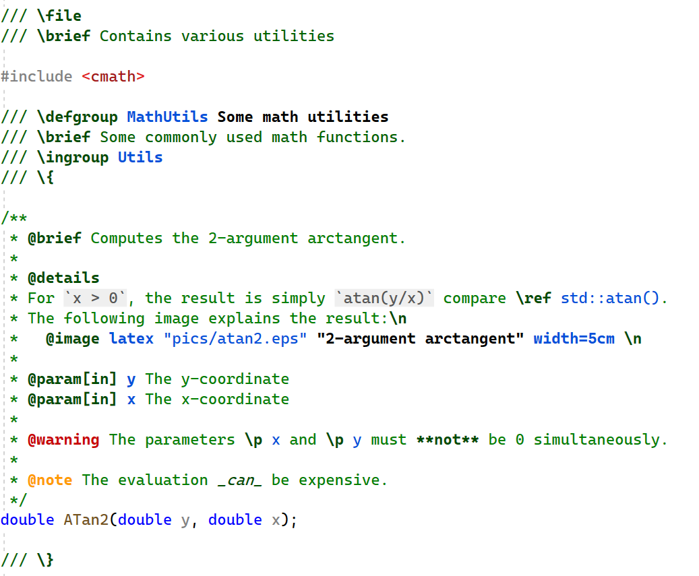
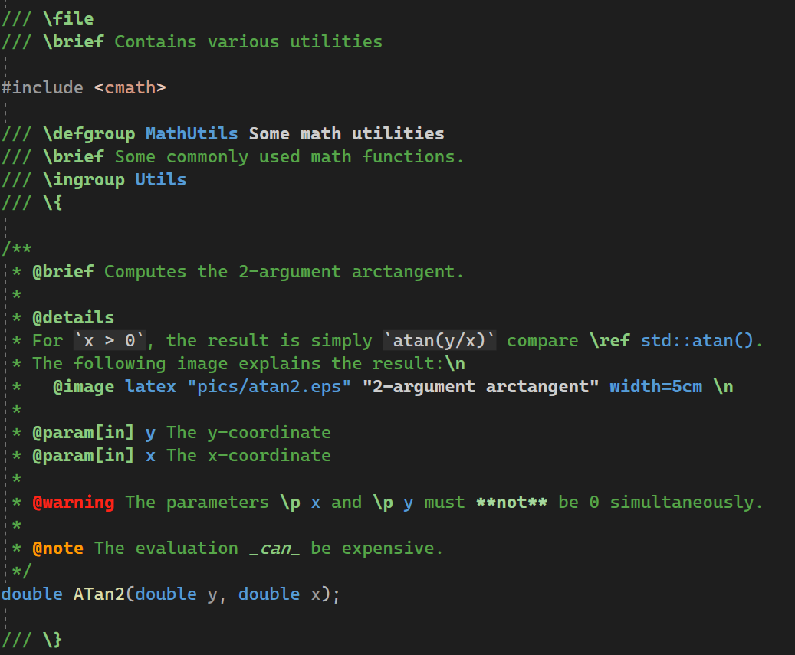
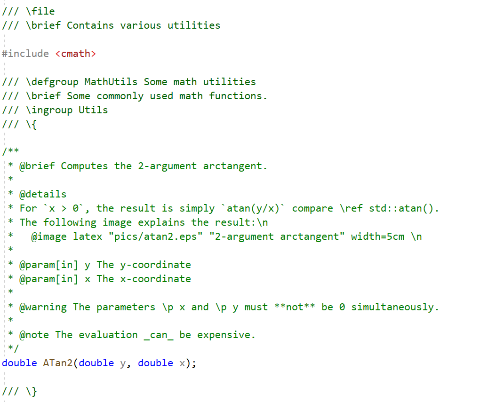
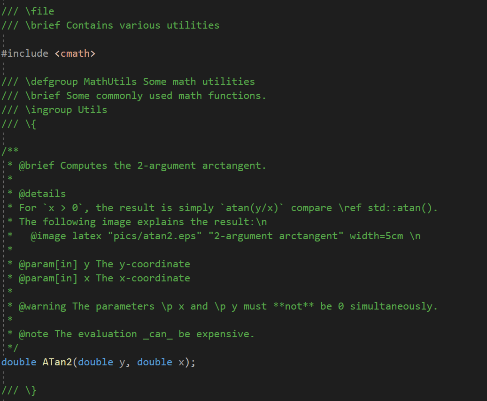

# VSDoxyHighlighter <!-- omit in toc -->

- [Introduction](#introduction)
- [Installation](#installation)
- [About the extension's functionality](#about-the-extensions-functionality)
  - [Highlighted locations](#highlighted-locations)
  - [Supported elements of Doxygen](#supported-elements-of-doxygen)
  - [Not yet supported and future ideas](#not-yet-supported-and-future-ideas)
  - [Configuration](#configuration)
  - [Known problems](#known-problems)

# Introduction

VSDoxyHighlighter is an extension for Visual Studio 2022 and above to provide syntax highlighting for [Doxygen](https://www.doxygen.nl/index.html) style comments in C++.
Note that Visual Studio Code is **not** supported.

The following two images show the default colors used for light and dark color themes by the extension (they are configurable!):
Light             |  Dark 
:--------:|:--------:
 | 

To contrast it, here is the default display without this extension:
Light             |  Dark 
:--------:|:--------:
 | 

The aim of the extension is to make reading and writing Doxygen style comments in Visual Studio easier.
The highlighting effectively performs a rough check while writing them whether the commands are correct.
But even if Doxygen is not used to generate documentation for the source code, I personally have found it convenient to use the commands in order to provide some consistent structure to the documentation.
Especially, important messages such as warnings or notes are harder to overlook while reading the source code.

# Installation

Only Visual Studio 2022 and above is supported.

**TODO**

# About the extension's functionality

## Highlighted locations
Currently, the highlighting is enabled in **all** C-style comments (i.e. in `/* ... */`, not just in e.g. `/** ... */` or `/*! ... */`). 
Moreover, the treatment of C++ single line comments (`//`) is somewhat inconsistent: After `///` and `//!`, everything is highlighted, but for ordinary comments (`//`) only keywords that may appear in the middle of text is highlighted. Improving this is planned for the future.

## Supported elements of Doxygen
- Just like Doxygen, the Javadoc style (commands prefixed by `@` instead of `\`) is also supported.
- All [special commands](https://www.doxygen.nl/manual/commands.html) of Doxygen <= 1.9.5.
- Parts of markdown: **`**bold**`**, __`__bold__`__, *`*italic*`*, _`_italic_`_, ~~`~~strikethrough~~`~~ (tildes), as well as `` `inline code` `` (single backticks only).

## Not yet supported and future ideas
- Differentiate between ordinary multiline comments (`/*`) and special ones (e.g. `/*!`). Also, allow optionally highlighting in ordinary C++ comments (`//`).
- Special highlighting of text in "environments" such as `\code` or `\f$`. Note that rendering of latex formulas is not planned, especially since there are already extensions available (e.g. ["TeX Comments"](https://marketplace.visualstudio.com/items?itemName=vs-publisher-1305558.VsTeXCommentsExtension2022) or ["InteractiveComments"](https://marketplace.visualstudio.com/items?itemName=ArchitectSoft.InteractiveCommentsVS2022)).
- Support for [HTML commands](https://www.doxygen.nl/manual/htmlcmds.html) is missing.
- Support for [XML commands](https://www.doxygen.nl/manual/xmlcmds.html) is missing.
- More [markdown support](https://www.doxygen.nl/manual/markdown.html).
- Some form of simple autocomplete of commands ("IntelliSense") while typing. However, generating a whole comment block is not planned, since there are already extensions that support this (e.g. ["DoxygenComments"](https://marketplace.visualstudio.com/items?itemName=NickKhrapov.DoxygenComments2022) or ["Doxygen Comments"](https://marketplace.visualstudio.com/items?itemName=FinnGegenmantel.doxygenComments)).

## Configuration

The extension comes with two different color schemes, one for dark and one for light Visual Studio themes.
The appropriate one is automatically selected.
To this end, the detection of the theme is not coupled to the name of the theme. Instead, the decision is made based on the color of the background. As such, the default colors should be reasonable for more than just the default themes shipped with Visual Studio.

The colors and fonts used for the various keywords can be configured in the Visual Studio settings &rarr; Environment &rarr; Fonts and Colors. All elements corresponding to the extension start with "DoxyHighlighter".
Note that Visual Studio stores the settings per color theme.

## Known problems
- Handling of keywords in `//` comments is inconsistent, as noted above.
- The extension comes with two different color schemes, for dark and light color themes. However, changing the color theme of Visual Studio does not properly adapt the colors. In principle, [there is code](https://github.com/Sedeniono/VSDoxyHighlighter/blob/846fb0a16e4a67921672bd6db3a35088b26bd159/VSDoxyHighlighter/DefaultColors.cs#L101) that should take care of it, but for reasons currently unknown to me it does not work well. In this case, a workaround is to uninstall and reinstall the extension after having switched the theme.
- The extension does not work in VS 2019 or earlier. There is currently no plan to support versions older than VS 2022.
