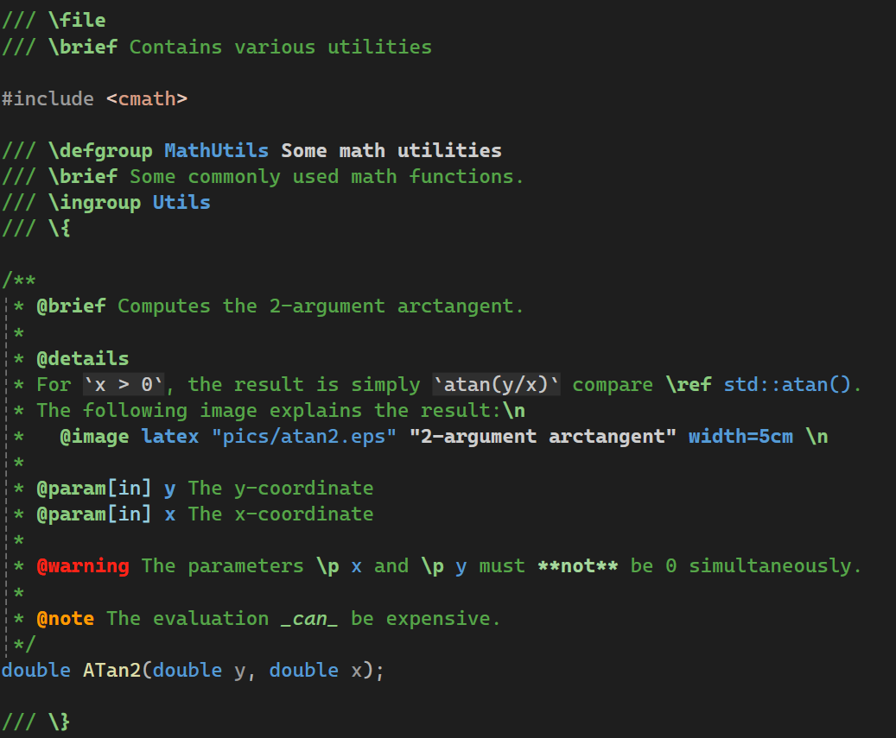

# VSDoxyHighlighter <!-- omit in toc -->

- [Introduction](#introduction)
- [Installation](#installation)
- [About the extension's functionality](#about-the-extensions-functionality)
  - [Supported elements of Doxygen](#supported-elements-of-doxygen)
  - [Not yet supported and future ideas](#not-yet-supported-and-future-ideas)
  - [Configuration](#configuration)
    - [Fonts and colors](#fonts-and-colors)
    - [Configuring the comment types](#configuring-the-comment-types)
  - [Known problems](#known-problems)

# Introduction

VSDoxyHighlighter is an extension for Visual Studio 2022 and above to provide syntax highlighting for [Doxygen](https://www.doxygen.nl/index.html) style comments in C/C++.
Note that Visual Studio Code is **not** supported.

The following two images show the default colors used for light and dark color themes by the extension (they are configurable!):
Light             |  Dark 
:--------:|:--------:
 | 

To contrast it, here is the default display without this extension:
Light             |  Dark 
:--------:|:--------:
 | 

The aim of the extension is to make reading and writing Doxygen style comments in Visual Studio easier.
The highlighting effectively performs a rough check while writing them whether the commands are correct.
But even if Doxygen is not used to generate documentation for the source code, I personally have found it convenient to use the commands in order to provide some consistent structure to the documentation.
Especially, important messages such as warnings or notes are harder to overlook while reading the source code.

# Installation

Only Visual Studio 2022 and above is supported.
You can get the extension from the [Visual Studio marketplace](https://marketplace.visualstudio.com/items?itemName=Sedenion.VSDoxyHighlighter).

All releases can also be found [here on github](https://github.com/Sedeniono/VSDoxyHighlighter/releases): Download the `*.vsix` file and open it to install the extension.

# About the extension's functionality

## Supported elements of Doxygen
For an introduction of Doxygen, please see [its webpage](https://www.doxygen.nl/index.html).

- The syntax highlighting can be enabled in comments starting with `/*`, `/**`, `/*!`, `//`, `///` or `//!`. The enabled comment types can be configured in the Visual Studio options under the VSDoxyHighlighter node. By default, syntax highlighting is not applied to `//` and `/*` comments because Doxygen does not parse those.
- Just like Doxygen, the Javadoc style (commands prefixed by `@` instead of `\`) is also supported. For example, both `\brief` and `@brief` are highlighted.
- [All commands](https://www.doxygen.nl/manual/commands.html) of Doxygen (<= 1.9.5) are supported.
- Parts of markdown: **`**bold**`**, __`__bold__`__, *`*italic*`*, _`_italic_`_, ~~`~~strikethrough~~`~~ (tildes), as well as `` `inline code` `` (single backticks only).

## Not yet supported and future ideas
- Special highlighting of text in "environments" such as `\code` or `\f$`. Note that rendering of latex formulas is not planned, especially since there are already extensions available (e.g. ["TeX Comments"](https://marketplace.visualstudio.com/items?itemName=vs-publisher-1305558.VsTeXCommentsExtension2022) or ["InteractiveComments"](https://marketplace.visualstudio.com/items?itemName=ArchitectSoft.InteractiveCommentsVS2022)).
- Support for [HTML commands](https://www.doxygen.nl/manual/htmlcmds.html) is missing.
- Support for [XML commands](https://www.doxygen.nl/manual/xmlcmds.html) is missing.
- More [markdown support](https://www.doxygen.nl/manual/markdown.html).
- Some form of simple autocomplete of commands ("IntelliSense") while typing. However, generating a whole comment block is not planned, since there are already extensions that support this (e.g. ["DoxygenComments"](https://marketplace.visualstudio.com/items?itemName=NickKhrapov.DoxygenComments2022) or ["Doxygen Comments"](https://marketplace.visualstudio.com/items?itemName=FinnGegenmantel.doxygenComments)).

## Configuration

### Fonts and colors
The extension comes with two different color schemes, one for dark and one for light Visual Studio themes.
The appropriate default scheme is selected automatically.
To this end, the detection of the active Visual Studio theme is not coupled to the name of the theme. Instead, the decision is made based on the color of the background. As such, the default colors should be reasonable for more than just the default themes shipped with Visual Studio.

The colors and fonts used for the various keywords can be configured in the Visual Studio settings &rarr; Environment &rarr; Fonts and Colors. All elements corresponding to the extension start with **"VSDoxyHighlighter"**.
Note that Visual Studio stores the settings per color theme.

One thing that you might realize is that the color of ordinary text in "`///`"-comments might be different to the color in other comments.
This has nothing to do with the extension. Visual Studio classifies "`///`"-comments as "XML Doc Comment" and formats them differently by default.
You can change the color in the "Fonts and Colors" settings.

### Configuring the comment types
You can configure separately whether the extension should perform highlighting in `/*`, `/**`, `/*!`, `//`, `///` or `//!` comments.
In the Visual Studio options, see the settings under the "VSDoxyHighlighter" node.
By default, syntax highlighting is not applied to `//` and `/*` comments because Doxygen does not parse those.

## Known problems
- The extension does not work in VS 2019 or earlier. There is currently no plan to support versions older than VS 2022.
- The extension comes with two different color schemes, namely for dark and light color themes. Changing the Visual Studio theme should immediately adapt the comment colors. However, in rare cases this happens only partially (such as some bold formatting not being applied correctly). To fix this, restart Visual Studio. If the colors are still wrong, please uninstall and reinstall the extension.
