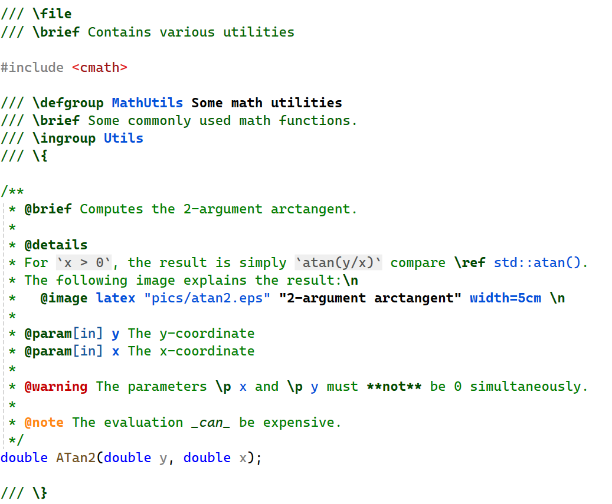

# VSDoxyHighlighter <!-- omit in toc -->

- [Introduction](#introduction)
- [Installation](#installation)
- [Features](#features)
  - [Syntax highlighting](#syntax-highlighting)
  - [IntelliSense (autocomplete while typing)](#intellisense-autocomplete-while-typing)
    - [Autocomplete of Doxygen commands](#autocomplete-of-doxygen-commands)
    - [Autocomplete of arguments of Doxygen commands](#autocomplete-of-arguments-of-doxygen-commands)
  - [Quick info tooltips](#quick-info-tooltips)
  - [Not yet supported and future ideas](#not-yet-supported-and-future-ideas)
- [Configuration](#configuration)
  - [Fonts and colors](#fonts-and-colors)
    - [Classifications](#classifications)
    - [Mapping of commands and parameters to classifications](#mapping-of-commands-and-parameters-to-classifications)
    - [Color schemes](#color-schemes)
  - [Comment types](#comment-types)
- [Known problems](#known-problems)

# Introduction

VSDoxyHighlighter is an extension for Visual Studio 2022 to provide **syntax highlighting**, **IntelliSense** (autocomplete while typing) and **quick info** tooltips (while hovering over commands) for [Doxygen](https://www.doxygen.nl/index.html) style comments in C/C++.  
Note that Visual Studio Code is **not** supported.

**If you like the extension, please give it a [star on GitHub](https://github.com/Sedeniono/VSDoxyHighlighter) and rate on the [Visual Studio marketplace](https://marketplace.visualstudio.com/items?itemName=Sedenion.VSDoxyHighlighter)!**

# Installation

You can get the extension from the [Visual Studio marketplace](https://marketplace.visualstudio.com/items?itemName=Sedenion.VSDoxyHighlighter).
All releases can also be found [here on github](https://github.com/Sedeniono/VSDoxyHighlighter/releases): Download the `*.vsix` file and open it to install the extension.

Only Visual Studio 2022 is supported.

For a list of the most important changes in each version (change log), also see the [list of releases](https://github.com/Sedeniono/VSDoxyHighlighter/releases).

# Features
For an introduction of Doxygen, please see [its webpage](https://www.doxygen.nl/index.html).

## Syntax highlighting

The following two images show the default colors used for light and dark color themes by the extension (they are configurable!):
Light             |  Dark 
:--------:|:--------:
 | 

To contrast it, here is the default display without this extension:
Light             |  Dark 
:--------:|:--------:
 | 

The colors aim to make reading and writing Doxygen style comments in Visual Studio easier.
The highlighting effectively performs a rough check while writing them whether the commands are correct.
But even if Doxygen is not used to generate documentation for the source code, I personally have found it convenient to use the commands in order to provide some consistent structure to the documentation.
Especially, important messages such as warnings or notes are harder to overlook while reading the source code.

- The syntax highlighting can be enabled in C/C++ comments starting with `/*`, `/**`, `/*!`, `//`, `///` or `//!`. The enabled comment types can be configured in the Visual Studio options under the VSDoxyHighlighter node. By default, syntax highlighting is not applied to `//` and `/*` comments because Doxygen does not parse those.
- Just like Doxygen, the Javadoc style (commands prefixed by `@` instead of `\`) is also supported. For example, both `\brief` and `@brief` are highlighted.
- [All commands](https://www.doxygen.nl/manual/commands.html) of Doxygen (<= 1.12.0) are supported.
- Highlighting partially supports markdown: **`**bold**`**, __`__bold__`__, *`*italic*`*, _`_italic_`_, ~~`~~strikethrough~~`~~ (tildes), as well as `` `inline code` `` (single backticks only).
- The extension comes with two different default color schemes, one for dark and one for light Visual Studio themes. The colors can also be configured. See the configuration section below for more information.
- Syntax highlighting can be disabled entirely in the VSDoxyHighlighter options.

## IntelliSense (autocomplete while typing)

### Autocomplete of Doxygen commands

- If you type an `@` or `\` in a comment, an autocomplete box listing all Doxygen commands appears. Pressing tab, enter or space will autocomplete the currently selected command.
- Just as for the syntax highlighting, the autocomplete box will appear only in comment types (`/*`, `/**`, etc.) which have been enabled. This can be configured in the VSDoxyHighlighter options.
- The box shows the commands as documented on the [Doxygen help page](https://www.doxygen.nl/manual/commands.html). The help text for each command is also taken from there.
- IntelliSense can be disabled entirely in the VSDoxyHighlighter options.

### Autocomplete of arguments of Doxygen commands

Additional autocompletion is provided for the arguments of the following Doxygen commands:
  - `\param` (and its `in`/`out` variations): Lists the parameters of the next function or macro.
  - `\tparam`: Lists the template parameters of the next template function, class, struct or alias template ("`using`").
  - `\p`, `\a`: Lists both the "normal" parameters (if any) and the template parameters (if any) of the next function, macro, class, struct or alias template ("`using`").

These can be disabled separately in the VSDoxyHighlighter options.

## Quick info tooltips

Hovering with the mouse over Doxygen commands or one of their parameters will display the documentation from the [Doxygen help page](https://www.doxygen.nl/manual/commands.html) as a tooltip.

The quick info box also includes a direct hyperlink to the online documentation: Clicking on "`Click HERE to open the online documentation`" will open the webpage in your default browser.
Moreover, cross references to other webpages and commands are also preserved as clickable hyperlinks.
Remark: The clickable hyperlinks are not included in the tooltips shown in the IntelliSense autocomplete box because Visual Studio does not support hyperlinks there.

As for the other features, the quick info tooltip will only appear in comment types (`/*`, `/**`, etc.) that have been enabled in the VSDoxyHighlighter options.
This feature can be disabled in the VSDoxyHighlighter options.

## Not yet supported and future ideas
- Special highlighting of text in "environments" such as `\code` or `\f$`. Note that rendering of latex formulas is not planned, especially since there are already extensions available (e.g. ["TeX Comments"](https://marketplace.visualstudio.com/items?itemName=vs-publisher-1305558.VsTeXCommentsExtension2022) or ["InteractiveComments"](https://marketplace.visualstudio.com/items?itemName=ArchitectSoft.InteractiveCommentsVS2022)).
- Support for [HTML commands](https://www.doxygen.nl/manual/htmlcmds.html) is missing.
- Support for [XML commands](https://www.doxygen.nl/manual/xmlcmds.html) is missing.
- More [markdown support](https://www.doxygen.nl/manual/markdown.html).
- Generating a whole comment block automatically is currently not planned: 
  - Visual Studio 16.6 and above support this out-of-the-box, compare [this blog post](https://devblogs.microsoft.com/cppblog/doxygen-and-xml-doc-comment-support/).
  - There are also extensions available that allow a more fine grained control over the generated comment, e.g. ["Doxygen Comments"](https://marketplace.visualstudio.com/items?itemName=FinnGegenmantel.doxygenComments) or ["DoxygenComments"](https://marketplace.visualstudio.com/items?itemName=NickKhrapov.DoxygenComments2022) (yes, these two extensions have almost the same name).
- Allow adding custom commands.

# Configuration

## Fonts and colors

### Classifications
The extension comes with several so called "classifications". Those are the entires shown in the in the Visual Studio options &rarr; *Environment* &rarr; *Fonts and Colors*. All elements corresponding to the extension start with "VSDoxyHighlighter".
Feel free to change the colors to your liking.

One thing that you might realize is that the color of ordinary text in "`///`"-comments might be different to the color in other comments.
This has nothing to do with the extension. Visual Studio classifies "`///`"-comments as "XML Doc Comment" and formats them differently by default.
You can change the color in the *Fonts and Colors* settings.

### Mapping of commands and parameters to classifications
A different topic is how the extension maps some given command and its parameters to the classifications.
This mapping can be configured, too, by opening the VS options &rarr; *VSDoxyHighlighter* &rarr; *General*.
Then select the "*Individual Doxygen commands*" row and click on the "..." button on the right.
This allows you to change, for every command individually, the classifications used for the command itself and all of its parameters.
Note that adding or removing commands is currently not supported.

To give a bit more freedom, the extension defines some additional classifications "Generic1", "Generic2", etc.
These are **not** used by default for anything.
However, you may use them to colorize some commands or parameters differently compared to the defaults, without affecting the colors for all other commands and parameters.
For example, assume you want to change the color of only the `\brief` command to a specific yellow. All other commands (such as `\details` etc.) should remain unchanged.
Then you could change the classification of the `\brief` command to "Generic1" and (in the *Environment* &rarr; *Fonts and Colors* settings) change the color of the "VSDoxyHighlighter - Generic 1" classification to yellow. As long as the classification is not used by any other command or parameter, `\brief` will exclusively use the specific yellow.
In case the number of available "Generic" classifications is not enough, feel free to [create an issue](https://github.com/Sedeniono/VSDoxyHighlighter/issues).

### Color schemes
The extension comes with two different color schemes, one for dark and one for light Visual Studio themes. 
(The theme can be changed in the VS options by going to *Environment* &rarr; *General* and changing the *Color Theme* setting).
The appropriate default scheme is selected automatically based on the current VS theme.
The detection of the active VS theme is not coupled to the name of the theme. Instead, the decision is made based on the color of the background. As such, the default colors should be reasonable for more than just the default themes shipped with Visual Studio.

Visual Studio stores the settings per color theme. 
For example, assume you change the color of titles to e.g. red.
Then you switch the theme. Then the color of the titles will have switched to the new theme's currently configured color, and the colors shown in the *Fonts and Colors* section will have changed accordingly.
You can then configure the colors for that theme, e.g. titles to green.
If you then switch back to the original theme, all colors will switch back, too, and you will get the originally configured red color for titles again.

## Comment types
In the Visual Studio options, see the settings under the "VSDoxyHighlighter" node.

You can configure separately for each comment type (`/*`, `/**`, `/*!`, `//`, `///` or `//!`) whether the extension should perform highlighting and autocomplete.
By default, the comment types `//` and `/*` are disabled because Doxygen does not parse those.

# Known problems
- The extension does not work in VS 2019 or earlier. There is currently no plan to support versions older than VS 2022.
- The extension comes with two different color schemes, namely for dark and light color themes. Changing the Visual Studio theme should immediately adapt the comment colors. However, in rare cases this happens only partially (such as some bold formatting not being applied correctly). To fix this, restart Visual Studio. If the colors are still wrong, please uninstall and reinstall the extension.
- IntelliSense for the argument completion of `\tparam`, `\p` and `\a` do not show non-type template parameters of global class/function declarations. The underlying issue is that the Visual Studio [`VCFileCodeModel`](https://learn.microsoft.com/en-us/dotnet/api/microsoft.visualstudio.vccodemodel.vcfilecodemodel) does not provide any information for such declarations. To workaround this, the extension uses an alternate method to retrieve the information, which unfortunately lacks knowledge about non-type template parameters.
- IntelliSense for the argument completion of `\param`, `\p` and `\a` might show incomplete or no type information for function parameters of global class/function declarations. The reason is the same as in the bullet point above: `VCFileCodeModel` does not provide sufficient information, and the implemented workaround is imperfect.
